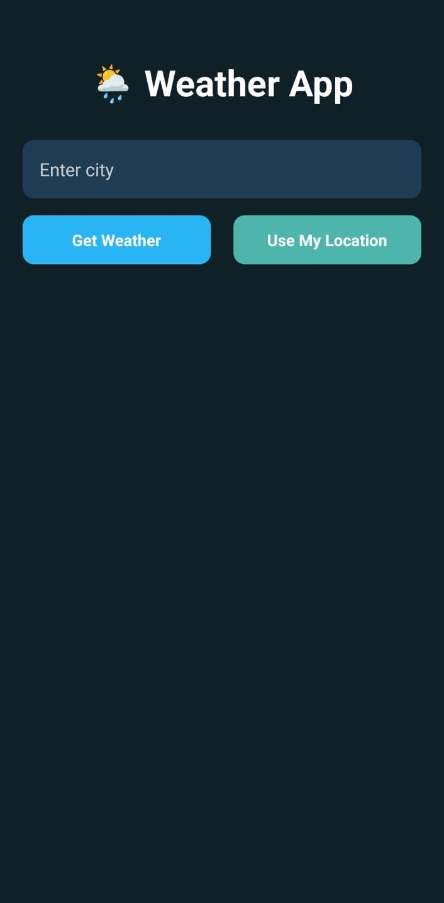
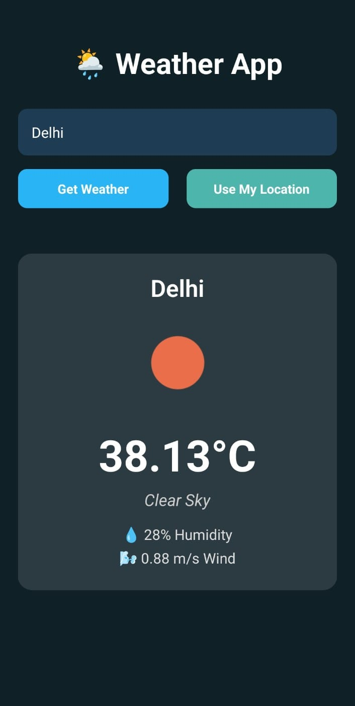

# 🌦️ Weather Forecast App (React Native + Expo)

A modern, location-aware weather forecast app built using React Native, Expo, and OpenWeatherMap API.  
Supports both **city-based search** and **GPS-based weather**, with a beautiful gradient UI and animated icons.

---

## 📱 Features

- 🔍 Search weather by city name
- 📍 Fetch weather using real-time GPS location
- 🌤️ Dynamic weather icons and temperature display
- 💧 Humidity, wind speed, and description
- 🎨 Beautiful modern UI (card design + dark theme)
- 📦 Built APK ready for Android

---

## 🧪 Tech Stack

- **React Native + Expo**
- **OpenWeatherMap API**
- **Expo Location**
- **EAS Build** (for APK generation)

---

## 🚀 Screenshots

| Home Screen            | Weather Card UI         |
|------------------------|-------------------------|
|  |  |


---

## 📦 APK

Download the latest APK:  
👉 [Download APK](https://expo.dev/accounts/loki_16/projects/WeatherApp/builds/1e0256de-6a71-43da-aa00-bdde492dafe5)

---

## 🔧 Setup Instructions

1. Clone the repo:        
```bash
https://github.com/LOKii1612/Weather_Forecast_App.git
```

1. Install dependencies

   ```bash
   npm install
   ```

2. Start the app

   ```bash
   npx expo start
   ```


